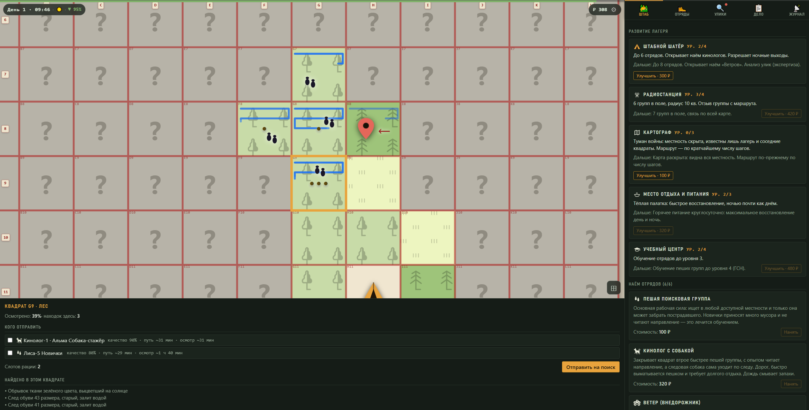

# 🚨 Оперативный штаб · Поиск пропавшего

**Браузерная игра-стратегия про поисково-спасательную операцию.**
Разверните штаб, соберите отряды и найдите пропавшего в лесу, пока не истекло время. 🧭

[](https://cash-metall.github.io/rescue-strategy-game/)




---

## 🧭 Что это

Вы — координатор поисково-спасательной операции. Пропал человек; известна лишь **точка последнего
контакта** и приметы. Ваша задача — грамотно распорядиться ограниченными силами: отправлять отряды
разведывать квадраты леса, разбирать привезённые находки, отделять настоящие следы от мусора и по
цепочке улик сужать район поиска — **пока состояние пропавшего не стало критическим**.

Штаб и обученные команды **переходят из дела в дело** (кампания сохраняется в браузере), поэтому
вложения в развитие и обучение окупаются в следующих операциях.

Время ограничено, но ноль на таймере — **не конец игры**: медики уезжают, поиск продолжается, и шансы
найти живым падают до 50/50. Дело всегда доигрывается до находки — вопрос лишь в том, **каким**
человека найдут.

## 🎮 Как играть

1. **Кликните квадрат** на карте → выберите отряды → **«Отправить»**. Задача одна — прочесать
   квадрат целиком; сколько это займёт, игра посчитает и покажет заранее. Если свободен «Ветер» —
   подвезёт, и группа выйдет на осмотр свежей.
2. **Разбирайте находки** во вкладке «Улики»: сверяйте цвет одежды и размер обуви с приметами из
   «Дела» и решайте — 📌 настоящая улика или 🗑 мусор. Ошибётесь — поведёте поиск не туда. Новички
   приносят много лишнего; опытные группы читают направление движения.
3. **Проверяйте наводки.** Коптер ничего не обследует — он лишь отмечает «возможные цели» на снимках,
   и часть из них ложные. Достать улику или пострадавшего может только наземная группа.
4. **Развивайте штаб** и нанимайте отряды; **берегите людей** — уставшие ищут медленнее, а каждый
   выход может закончиться происшествием: от севшего фонаря до травмы.
5. Найдите пропавшего — и **следующее дело** на новой карте, с тем же штабом.

## 🥾 Отряды

У каждого типа своя ветка прокачки — от новичков до специалистов.

| Отряд | Роль |
|---|---|
| 🥾 **Лиса** (пешая группа) | Основная рабочая сила: ищет везде, и только она забирает пострадавшего. Новички носят много мусора и не читают направление — это лечится обучением, вплоть до ГСН. |
| 🐕 **Кинолог с собакой** | Закрывает квадрат втрое быстрее, с опытом читает направление, а следовая собака сама уходит по следу. Дорог и требует долгого отдыха. Дождь смывает запахи. |
| 🚙 **Ветер** (внедорожник) | **Не ищет сам** — возит группы к квадрату и обратно. Пассажиры не устают в дороге. Болото и чащу берёт только экипаж со штурманом. |
| 🛸 **Коптер** (БПЛА) | **Только разведка:** квадрат не обследует и улик не приносит, зато ставит на карту «возможные цели». Лучше всего видит костры и яркую одежду. Чащу не берёт. Дорогая игрушка. |

## 🏕️ Штаб

| Постройка | Что даёт |
|---|---|
| ⛺ **Штабной шатёр** | Больше отрядов и доступ к найму новых типов. |
| 📻 **Радиостанция** | Больше групп в поле и радиус связи; с ур. 2 группы передают описание находок сразу по рации, с ур. 3 — отзыв с маршрута. |
| 🗺️ **Картограф** | Экспертиза улик и карта вероятности 🔥. |
| 🍲 **Место отдыха** | Быстрее восстанавливает силы отрядов. |
| 🎓 **Учебный центр** | Обучение отрядов: выше уровень — внимательнее поиск, меньше мусора и реже происшествия. Но группа покидает текущее дело. |

## ✨ Особенности

- **Кампания** — штаб и уровни обучения отрядов переносятся между делами (сохранение в `localStorage`).
- **Процедурная генерация** — каждое дело: новая карта леса, пропавший, приметы и маршрут.
- **Детективная механика** — игрок сам отделяет улики от мусора; ошибка стоит времени.
- **Происшествия** — с вероятностью 30% выход не пройдёт гладко: севший навигатор, отказ рации,
  пробитое колесо, травма. Чем опытнее группа, тем реже.
- **Погода, день/ночь, усталость** — влияют на темп поиска: плохие условия стоят времени, а не
  внимательности.
- **Mobile-first** — карта тянется по ширине экрана, вкладки снизу, панели выезжают снизу; на десктопе
  автоматически раскрывается двухколоночная раскладка.
- **Без бэкенда** — статическая сборка, ничего не уходит в сеть.

## 💻 Локальный запуск

Для разработки нужен Node.js:

```bash
npm install
npm run dev        # dev-сервер с HMR → http://localhost:5173/
```

Собрать прод-версию и посмотреть её:

```bash
npm run build      # → статика в dist/
npm run preview    # → http://localhost:4173/
```

> [!IMPORTANT]
> Базовый путь сборки задаётся переменной окружения: `vite.config.ts` берёт
> `base: process.env.VITE_BASE ?? '/'`. По умолчанию игра рассчитана на **корень домена** — так её
> раздаёт любой статический сервер и так же работают `dev` и `preview`. Чтобы собрать под
> подкаталог, передайте путь явно:
>
> ```bash
> VITE_BASE=/rescue-strategy-game/ npm run build
> ```
>
> Пути к скрипту, стилям и SVG считаются от этой базы, поэтому адрес раздачи и `VITE_BASE` должны
> совпадать — иначе ассеты вернут 404.

Например, через Python:

```bash
cd dist && python -m http.server 8000   # → http://localhost:8000/
```

> [!NOTE]
> Открыть `dist/index.html` двойным кликом через `file://` не получится: и ES-модули требуют HTTP,
> и пути к ассетам абсолютные.

## 🚀 Деплой

GitHub Pages собирает игру сам: `.github/workflows/deploy.yml` на каждый push в `main` выполняет
`npm ci && npm run build` с `VITE_BASE=/rescue-strategy-game/` и публикует свежий `dist/`. Руками
ничего запускать не нужно.

Для стороннего хостинга: `npm run build` и отдать `dist/` по корню домена. Если игра должна жить в
подкаталоге — пересобрать с `VITE_BASE=/этот/путь/`. Папка `dist/` закоммичена для ручной передачи
(собрана под корень), но опубликованный на Pages сайт всегда из свежей сборки CI.

## 📂 Структура

```
src/
  engine/     чистая логика игры (TS, без DOM) — движок, тестируется в Node:
              поиск пути, события и инциденты, симуляция, действия, кампания
  state/      стор на Svelte-рунах (game.svelte.ts) и очередь тостов (fx.svelte.ts)
  components/ Svelte-компоненты UI (карта, панели, вкладки, модалки)
  styles/     переменные и общие стили
  test/       тесты движка (vitest): генерация, авто-игрок, кампания, механики
public/images/  SVG-ассеты (топознаки местности, отряды, штаб, маркеры)
dist/           собранная игра (закоммичена для ручной передачи; CI пересобирает сам)
docs/           документация по игровым системам и журнал решений
legacy/         первая однофайловая версия (rescue-hq.html) — исторический референс
```

## 🧪 Тесты

Игровая логика вынесена в чистый движок (`src/engine`) и покрыта тестами — это «замок баланса»:
UI не может незаметно изменить механику.

```bash
npm test           # 52 теста: генерация карт, авто-игрок (баланс), кампания, механики, движение
npm run check      # проверка типов (svelte-check)
```

Балансный прогон идёт на **сидированном** PRNG, поэтому числа воспроизводимы и «регресс баланса»
отличим от неудачной серии бросков. Подробности — в [`docs/testing.md`](docs/testing.md), причины
принятых решений — в [`docs/devlog.md`](docs/devlog.md).

---

<div align="center">

Игра, код и документация созданы с помощью ИИ 🤖 · движок портирован из однофайловой версии дословно

</div>
